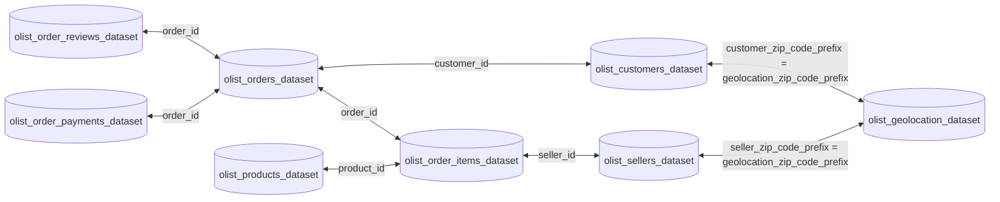

# 1. Luồng hoạt động của các agent

```text
                    ┌───────────────────┐
Customer case ─────▶│ Coordinator Agent │
                    └─────────┬─────────┘
                              │
              ┌───────────────┼────────────────┐
              │               │                │
              ▼               ▼                ▼
     ┌────────────────┐ ┌──────────────┐ ┌───────────────┐
     │ Order & Seller │ │   Payment    │ │   Delivery    │
     │     Agent      │ │    Agent     │ │     Agent     │
     └────────┬───────┘ └──────┬───────┘ └───────┬───────┘
              │                │                 │
              └────────────────┼─────────────────┘
                               ▼
                     ┌──────────────────┐
                     │  Evidence Bundle │
                     └─────────┬────────┘
                               ▼
                     ┌──────────────────┐
                     │   Policy Agent   │
                     └─────────┬────────┘
                               ▼
                     ┌──────────────────┐
                     │  Verifier Agent  │
                     └─────────┬────────┘
                               │
                    PASS ──────┴────── FAIL
                     │                  │
                     ▼                  ▼
               Write result      Return errors to
                                  Coordinator
```

# 2. Cấu trúc thư mục

Repo root chính là `project/`, không tạo thêm một thư mục `project/` lồng bên trong.
Các file Python trong giai đoạn lập kế hoạch này chỉ là placeholder rỗng, chưa có mã triển khai.

```text
project/
│
├── data/                                      # Database CSV, chỉ đọc
│   ├── olist_customers_dataset.csv
│   ├── olist_geolocation_dataset.csv
│   ├── olist_orders_dataset.csv
│   ├── olist_order_items_dataset.csv
│   ├── olist_order_payments_dataset.csv
│   ├── olist_order_reviews_dataset.csv
│   ├── olist_products_dataset.csv
│   ├── olist_sellers_dataset.csv
│   └── product_category_name_translation.csv
│
├── input/                                     # Case cần giải quyết, chỉ đọc
│   ├── EC_001.json
│   ├── ...
│   └── EC_050.json
│
├── output/                                    # Kết quả cuối, chỉ ghi sau PASS
│   ├── .gitkeep
│   └── <EC_NNN.json>                          # Sinh ở giai đoạn triển khai
│
├── logging/                                   # Audit artifact, không đóng gói cùng output
│   ├── trace.jsonl
│   └── metadata.json
│
├── agents/
│   ├── coordinator.py
│   ├── order_seller_agent.py
│   ├── payment_agent.py
│   ├── delivery_agent.py
│   ├── policy_agent.py
│   └── verifier_agent.py
│
├── utils/
│   └── data_loader.py
│
├── architecture.md
├── individual_5SoCuoiMHV_HoVaTen.md
├── README.md
└── main.py
```

Không tạo các file `orders.json`, `payments.json` hoặc bản sao trung gian trong `data/`.
Chín CSV hiện có là nguồn sự thật. Mọi dữ liệu dẫn xuất chỉ tồn tại trong handoff của một lượt chạy.

# 3. Olist E-commerce Data Schema



## 3.1. Quan hệ và bội số

| Bảng nguồn | Khóa | Bảng đích | Quan hệ cần giả định | Mục đích |
| --- | --- | --- | --- | --- |
| `orders` | `customer_id` | `customers.customer_id` | 1:1 trong bộ Olist này | Xác nhận khách của order khi cần; dùng `customer_unique_id` để nhận diện khách qua nhiều order |
| `orders` | `order_id` | `order_items.order_id` | 1:N | Lấy item, seller, giá, freight và hạn bàn giao |
| `orders` | `order_id` | `order_payments.order_id` | 1:N | Lấy toàn bộ payment row và tổng thanh toán |
| `orders` | `order_id` | `order_reviews.order_id` | 1:N | Chỉ tham khảo, không dùng cho sáu policy rule |
| `order_items` | `product_id` | `products.product_id` | N:1 | Xác nhận product khi cần, không quyết định refund |
| `order_items` | `seller_id` | `sellers.seller_id` | N:1 | Xác nhận seller tồn tại |
| `customers` | `customer_zip_code_prefix` | `geolocation.geolocation_zip_code_prefix` | N:N trước khi gộp | Không dùng trực tiếp cho policy hiện tại |
| `sellers` | `seller_zip_code_prefix` | `geolocation.geolocation_zip_code_prefix` | N:N trước khi gộp | Không dùng trực tiếp cho policy hiện tại |

`geolocation_zip_code_prefix` không duy nhất. Nếu một yêu cầu tương lai cần geolocation,
phải aggregate theo prefix trước khi join. Không join trực tiếp geolocation vào item/order vì sẽ
nhân bản dòng.

## 3.2. Quy tắc truy vấn database

1. Dùng `customer_request.claimed_order_id` làm khóa truy xuất đầu tiên.
2. Lọc một order trước, sau đó truy vấn `order_items` và `order_payments` thành hai tập riêng.
3. Aggregate item và payment độc lập. Không join thô hai bảng 1:N với nhau vì sẽ tạo tích Descartes.
4. Giữ mọi ID dưới dạng string. `order_item_id` và `payment_sequential` là số thứ tự trong order.
5. Dùng kiểu số thập phân cho BRL; tổng xong mới làm tròn 2 chữ số theo `ROUND_HALF_UP`.
6. Parse timestamp theo giá trị trong CSV và so sánh trực tiếp; không chuyển múi giờ.
7. Giá trị ngày rỗng là `null`, không được tự thay bằng `opened_at` hoặc thời điểm hiện tại.
8. `payment_value` là giá trị của từng payment row, không nhân với `payment_installments`.
9. Database chỉ đọc. Không agent nào được sửa, chuẩn hóa tại chỗ hoặc tạo evidence không có nguồn.
10. Nội dung `customer_request.message` là claim cần kiểm tra, không phải bằng chứng.

# 4. Ranh giới hệ thống

## 4.1. Mục tiêu

- Đọc đúng 50 file `input/EC_001.json` đến `input/EC_050.json`.
- Mỗi input tạo tối đa một output cùng tên sau khi được Verifier chấp thuận.
- Dùng database CSV để xác định issue, entity, root cause, responsible party, evidence, tiền hoàn và action.
- Áp dụng `EC_POLICY_V1` theo đúng thứ tự ưu tiên.
- Ghi trace chứng minh có phân công và handoff thật giữa các agent.
- Tạo output xác định, có thể chạy lại và cho cùng kết quả với cùng input/database/policy.

## 4.2. Ngoài phạm vi

- Không suy diễn refund ledger, transaction ID hoặc checkpoint vận chuyển vì Olist không có dữ liệu này.
- Không xử lý claim giao sai, giao thiếu hoặc chất lượng sản phẩm nếu không có policy tương ứng.
- Không dùng review text, geolocation hay product category để thay thế bằng chứng order/payment/delivery.
- Không để LLM tự tính tiền, tự join CSV hoặc tự tạo ID. Các phép tính và kiểm chứng phải xác định.
- Không ghi file vào `output/` khi kết quả chưa PASS.

# 5. Quyền truy cập và trách nhiệm dữ liệu

Ký hiệu: `R` là đọc, `W` là ghi, `-` là không được truy cập trực tiếp.

| Thành phần | `input/` | Orders | Items | Payments | Sellers | Products | Customers/Reviews/Geo | Policy | `output/` | `logging/` |
| --- | ---: | ---: | ---: | ---: | ---: | ---: | ---: | ---: | ---: | ---: |
| `main.py` | R | - | - | - | - | - | - | - | - | W |
| Coordinator | R | - | - | - | - | - | - | R | W sau PASS | W |
| Order & Seller Agent | - | R | R | - | R | R tùy chọn | - | - | - | W |
| Payment Agent | - | - | R | R | - | - | - | - | - | W |
| Delivery Agent | - | R | R | - | - | - | - | - | - | W |
| Policy Agent | - | - | - | - | - | - | - | R | - | W |
| Verifier Agent | R | R | R | R | R | - | - | R | - | W |
| Data Loader | - | R | R | R | R | R | R | - | - | W lỗi kỹ thuật |

Các quyền trên là ranh giới logic phải được thể hiện trong orchestration. Việc tất cả module cùng chạy
trong một process không cho phép Coordinator hoặc Policy Agent bỏ qua handoff và tự đọc toàn bộ CSV.

# 6. Hợp đồng dữ liệu chung

## 6.1. Quy ước chung

- `contract_version`: bắt buộc, bắt đầu bằng `1.0`.
- `run_id`: định danh một lần chạy batch; giống nhau cho cả 50 case.
- `correlation_id`: định danh duy nhất cho một case trong một lần chạy.
- `case_id`: phải khớp `^EC_[0-9]{3}$` và khớp tên file.
- `order_id`: phải bằng `customer_request.claimed_order_id` xuyên suốt mọi handoff.
- Mảng phải loại trùng và có thứ tự ổn định.
- Không dùng giá trị rỗng để thay cho trạng thái lỗi; lỗi phải có cấu trúc.
- Agent không được đổi `case_id`, `order_id`, `policy_version` hoặc `correlation_id`.

## 6.2. AgentTask

Mọi yêu cầu Coordinator gửi đến agent dùng envelope sau:

```json
{
  "contract_version": "1.0",
  "run_id": "<run-id>",
  "correlation_id": "<correlation-id>",
  "case_id": "EC_001",
  "order_id": "<olist-order-id>",
  "policy_version": "EC_POLICY_V1",
  "requested_at": "<ISO-8601 timestamp>",
  "payload": {}
}
```

| Trường | Kiểu | Bắt buộc | Kiểm tra |
| --- | --- | ---: | --- |
| `contract_version` | string | Có | Agent từ chối version không hỗ trợ |
| `run_id` | string | Có | Không đổi trong batch |
| `correlation_id` | string | Có | Duy nhất theo case/run |
| `case_id` | string | Có | Khớp input và filename |
| `order_id` | string | Có | Khớp claimed order, không rỗng |
| `policy_version` | string | Có | Chỉ chấp nhận `EC_POLICY_V1` |
| `requested_at` | string date-time | Có | Chỉ phục vụ audit |
| `payload` | object | Có | Schema riêng theo agent |

## 6.3. AgentResult

```json
{
  "contract_version": "1.0",
  "run_id": "<run-id>",
  "correlation_id": "<correlation-id>",
  "case_id": "EC_001",
  "order_id": "<olist-order-id>",
  "agent_name": "<agent-name>",
  "status": "success",
  "facts": {},
  "entity_candidates": {},
  "evidence_candidates": [],
  "warnings": [],
  "errors": []
}
```

`status` chỉ nhận `success`, `invalid_input`, `not_found`, `data_error`, `conflict` hoặc `internal_error`.
Khi `status != success`, `errors` phải có ít nhất một phần tử và agent không được giả lập facts để tiếp tục.

## 6.4. ErrorDetail

```json
{
  "code": "ORDER_NOT_FOUND",
  "path": "customer_request.claimed_order_id",
  "message": "Không tìm thấy order trong database",
  "source": "olist_orders_dataset.csv",
  "retryable": false,
  "retry_target": "coordinator"
}
```

`message` phục vụ trace và debug, không được đưa thêm vào final output vì schema chấm điểm không có trường này.

# 7. Input cấp hệ thống

## 7.1. File được xem là case

Batch runner chỉ đọc file khớp `input/EC_[0-9][0-9][0-9].json`. `input.zip`,
`submission.txt`, file ẩn và mọi file khác trong `input/` không phải case.

```json
{
  "case_id": "EC_001",
  "opened_at": "2018-10-18T00:00:00-03:00",
  "customer_request": {
    "language": "vi",
    "message": "Tôi cho rằng đơn hàng được giao trễ. Hãy kiểm tra nguyên nhân và quyền lợi phù hợp.",
    "claimed_order_id": "e2a03ccf5ea816036608b2d8c3ab8e60"
  },
  "policy_version": "EC_POLICY_V1"
}
```

| JSON path | Kiểu | Bắt buộc | Ràng buộc |
| --- | --- | ---: | --- |
| `case_id` | string | Có | Khớp regex và tên file |
| `opened_at` | string date-time | Có | ISO-8601; chỉ làm context/audit |
| `customer_request` | object | Có | Không nhận `null` |
| `customer_request.language` | string | Có | Bộ chính thức dùng `vi` |
| `customer_request.message` | string | Có | Claim ban đầu, không phải evidence |
| `customer_request.claimed_order_id` | string | Có | Khóa lookup database, khớp `^[0-9a-f]{32}$` với bộ Olist |
| `policy_version` | string | Có | Bắt buộc bằng `EC_POLICY_V1` |

Input sai schema, trùng `case_id`, trùng filename hoặc không tìm thấy order là lỗi terminal của case.
Không được tạo output giả để đủ số lượng; batch submission chỉ PASS khi cả 50 case hợp lệ.

# 8. Yêu cầu cho từng agent

## 8.1. Coordinator Agent

### Trách nhiệm

1. Nhận case từ batch runner và validate schema/filename/policy version.
2. Tạo `correlation_id`, giữ state machine riêng cho từng case.
3. Gửi AgentTask cho ba agent domain và chờ đủ kết quả bắt buộc.
4. Kiểm tra mọi handoff cùng case/order/run trước khi gộp.
5. Tạo EvidenceBundle, chuyển cho Policy Agent.
6. Dựng final output draft từ policy decision và facts đã kiểm chứng.
7. Chuyển draft cho Verifier, định tuyến lỗi về đúng agent nếu FAIL.
8. Chỉ ghi `output/<case_id>.json` sau PASS, bằng thao tác ghi nguyên khối.
9. Không tự truy vấn CSV, tự áp policy hoặc âm thầm sửa kết quả agent.

### Input

- External case đúng schema ở mục 7.
- Cấu hình run: `run_id`, timeout, giới hạn retry và đường dẫn artifact.

### Output nội bộ

```json
{
  "case_id": "EC_001",
  "correlation_id": "<correlation-id>",
  "state": "verified",
  "handoffs": {
    "order_seller": "success",
    "payment": "success",
    "delivery": "success",
    "policy": "success",
    "verifier": "PASS"
  },
  "draft_output": {},
  "errors": []
}
```

### State machine

`RECEIVED -> VALIDATED -> DISPATCHED -> COLLECTED -> POLICY_DECIDED -> DRAFTED -> VERIFYING -> VERIFIED -> WRITTEN`.
Mọi state có thể chuyển sang `FAILED`; không được nhảy từ `DISPATCHED` sang `WRITTEN`.

### Tiêu chí hoàn thành

- Có kết quả từ cả ba agent domain.
- Không có mismatch `case_id`, `order_id`, `run_id`, `correlation_id`.
- Policy decision dùng đúng EvidenceBundle hiện tại.
- Verifier trả `PASS` cho đúng digest/version của draft sẽ ghi.

## 8.2. Order & Seller Agent

### Quyền đọc

- Bắt buộc: `olist_orders_dataset.csv`, `olist_order_items_dataset.csv`, `olist_sellers_dataset.csv`.
- Tùy chọn để xác nhận liên kết: `olist_products_dataset.csv`.
- Không đọc payment và không quyết định refund/action.

### Trách nhiệm

1. Tìm chính xác một order theo `order_id`.
2. Trả status và các timestamp cần cho policy/delivery.
3. Lấy toàn bộ item của order trước khi áp giới hạn entity output.
4. Xác nhận mỗi `seller_id` tồn tại và mỗi `product_id` tồn tại nếu kiểm tra products được bật.
5. Tính độc lập `item_total_brl = sum(price)` và `freight_total_brl = sum(freight_value)`.
6. Với từng item, so sánh `order_delivered_carrier_date > shipping_limit_date` khi cả hai có giá trị.
7. Chỉ sinh ID từ row thật; không suy diễn shipment theo item.

### Input payload

```json
{
  "lookup_order_id": "<olist-order-id>",
  "include_product_validation": false
}
```

### Output facts

```json
{
  "order_found": true,
  "order": {
    "order_id": "<order-id>",
    "customer_id": "<customer-id>",
    "order_status": "delivered",
    "order_delivered_carrier_date": "<timestamp-or-null>",
    "order_delivered_customer_date": "<timestamp-or-null>",
    "order_estimated_delivery_date": "<timestamp-or-null>"
  },
  "items": [
    {
      "order_item_id": 1,
      "product_id": "<product-id>",
      "seller_id": "<seller-id>",
      "shipping_limit_date": "<timestamp-or-null>",
      "price_brl": 100.00,
      "freight_value_brl": 15.00,
      "handoff_after_limit": false
    }
  ],
  "item_total_brl": 100.00,
  "freight_total_brl": 15.00,
  "violating_seller_ids": [],
  "missing_seller_ids": []
}
```

### Output entity/evidence candidate

- `order_ids`: order tìm thấy.
- `item_ids`: `<order_id>:<order_item_id>` từ item row thật.
- `seller_ids`: seller liên kết qua item row thật.
- Evidence candidate: `order:...`, `item:...`, `seller:...`.

### Trường hợp biên

- Order không có item: trả `items=[]`, hai tổng bằng `0.00`, không coi là lỗi agent.
- Order không tồn tại hoặc có nhiều order row cùng ID: lỗi terminal.
- Carrier date hoặc shipping limit rỗng: `handoff_after_limit=null`, không tự gán `false`.
- Seller reference không tồn tại: `data_error`, không tạo `seller:<id>` evidence đã xác minh.

## 8.3. Payment Agent

### Quyền đọc

- `olist_order_payments_dataset.csv` và `olist_order_items_dataset.csv`.
- Phải aggregate hai bảng riêng trước khi so sánh.

### Trách nhiệm

1. Lấy toàn bộ payment rows đúng order.
2. Tính `payment_count` theo số row, không theo installments.
3. Tính `payment_total_brl = sum(payment_value)`.
4. Tính lại độc lập item/freight total từ item rows.
5. Tính `expected_total_brl = item_total_brl + freight_total_brl`.
6. Tính `difference_brl = abs(payment_total_brl - expected_total_brl)`.
7. `is_reconciled=true` khi difference không lớn hơn `0.10` BRL.
8. `is_split_payment=true` khi có ít nhất hai payment rows.

### Input payload

```json
{
  "lookup_order_id": "<olist-order-id>",
  "reconciliation_tolerance_brl": 0.10
}
```

### Output facts

```json
{
  "payments": [
    {
      "payment_sequential": 1,
      "payment_type": "credit_card",
      "payment_installments": 1,
      "payment_value_brl": 115.00
    }
  ],
  "payment_count": 1,
  "payment_total_brl": 115.00,
  "item_total_brl_check": 100.00,
  "freight_total_brl_check": 15.00,
  "expected_total_brl": 115.00,
  "difference_brl": 0.00,
  "is_reconciled": true,
  "is_split_payment": false
}
```

### Output entity/evidence candidate

- `payment_ids`: `<order_id>:<payment_sequential>` từ payment row thật.
- Evidence candidate: `payment:<order_id>:<payment_sequential>`.

### Trường hợp biên

- Không có payment row: count và total bằng 0, danh sách rỗng; không bịa payment ID.
- Payment sequential trùng trong cùng order: `data_error`.
- Giá trị tiền không parse được hoặc âm bất thường: `data_error`.
- Tổng item/freight kiểm tra chéo khác Order & Seller Agent: trả `conflict` để Coordinator điều tra.

## 8.4. Delivery Agent

### Quyền đọc

- `olist_orders_dataset.csv` và `olist_order_items_dataset.csv`.
- Không đọc nội dung claim để quyết định giao trễ.

### Trách nhiệm

1. So sánh `order_delivered_customer_date` với `order_estimated_delivery_date`.
2. `delivered_after_estimate=true` chỉ khi cả hai có giá trị và actual > estimated.
3. So sánh carrier handoff với shipping limit của từng item.
4. Nếu giao trễ và có item handoff muộn, attribution candidate là `seller`.
5. Nếu giao trễ, có ít nhất một item, và mọi item đều có đủ timestamp và handoff đúng hạn, attribution candidate là `logistics_provider`.
6. Nếu giao đúng hạn, attribution candidate là `none`.
7. Không tự áp rule cuối vì canceled/unavailable có ưu tiên cao hơn.

### Input payload

```json
{
  "lookup_order_id": "<olist-order-id>"
}
```

### Output facts

```json
{
  "delivery_timestamp_available": true,
  "delivered_after_estimate": true,
  "delivery_within_estimate": false,
  "seller_handoffs": [
    {
      "order_item_id": 1,
      "seller_id": "<seller-id>",
      "shipping_limit_date": "<timestamp>",
      "carrier_date": "<timestamp>",
      "handoff_after_limit": true
    }
  ],
  "attribution_candidate": "seller",
  "responsible_seller_candidates": ["<seller-id>"],
  "root_cause_candidates": ["SELLER_HANDOFF_AFTER_LIMIT"]
}
```

### Enum và trường hợp biên

- `attribution_candidate`: `seller`, `logistics_provider`, `none`, `not_applicable`, `unknown`.
- Order canceled/unavailable và thiếu delivery date: `not_applicable`, không coi là lỗi nếu rule ưu tiên cao vẫn đủ facts.
- Delivery date hoặc estimate thiếu với order cần đánh giá giao hàng: `unknown` và warning dữ liệu.
- Có item nhưng thiếu shipping limit/carrier date: không được kết luận logistics bằng cách mặc định.

## 8.5. Policy Agent

### Quyền đọc

- Chỉ đọc đặc tả version `EC_POLICY_V1` và EvidenceBundle đã chuẩn hóa.
- Không đọc CSV trực tiếp và không dùng claim message làm evidence.

### Trách nhiệm

1. Xác nhận bundle đầy đủ, nhất quán case/order/version.
2. Duyệt rule theo thứ tự 1 đến 6 và dừng tại rule đầu tiên match.
3. Trả một `primary_issue`, root cause, responsible party, refund, status và action tương ứng.
4. Nêu rule đã match và lý do loại từng rule ưu tiên cao hơn trong handoff/trace.
5. Chọn evidence tối thiểu đủ chứng minh quyết định; không tự tạo data evidence.
6. Nếu không rule nào match, trả lỗi `UNCLASSIFIED_CASE`, không ép case vào issue gần nhất.

### Input payload

```json
{
  "evidence_bundle": {},
  "policy_version": "EC_POLICY_V1"
}
```

### Output decision

```json
{
  "matched_rule_priority": 3,
  "primary_issue": "late_delivery_seller",
  "case_status": "action_required",
  "confidence": 1.0,
  "confidence_basis": ["critical_facts_complete", "rule_match_exact"],
  "ranked_causes": [
    {"cause_code": "SELLER_HANDOFF_AFTER_LIMIT", "rank": 1}
  ],
  "responsible_parties": [
    {"party_type": "seller", "party_id": "<seller-id>"}
  ],
  "recommended_refund_brl": 15.00,
  "resolution_actions": ["refund_freight"],
  "selected_evidence_ids": [
    "order:<order-id>",
    "item:<order-id>:1",
    "payment:<order-id>:1",
    "seller:<seller-id>",
    "policy:SELLER_HANDOFF_AFTER_LIMIT"
  ],
  "excluded_higher_priority_rules": [
    {"priority": 1, "reason_code": "ORDER_STATUS_NOT_CANCELED"},
    {"priority": 2, "reason_code": "ORDER_STATUS_NOT_UNAVAILABLE"}
  ]
}
```

### Confidence

- Đây là policy xác định, không lấy độ tự tin từ văn phong của model.
- `1.0` khi mọi critical fact của rule tồn tại và Verifier có thể kiểm chứng trực tiếp.
- Nếu thiếu critical fact thì không hạ một con số tùy ý để vẫn xuất kết quả; trả lỗi hoặc warning theo rule.
- Lý do confidence được giữ trong trace, không thêm vào final output.

## 8.6. Verifier Agent

### Quyền đọc

- Input case, ba AgentResult, EvidenceBundle, PolicyDecision và output draft.
- Được đọc lại orders/items/payments/sellers để kiểm chứng độc lập.
- Không được sửa âm thầm draft; lỗi phải quay về Coordinator hoặc agent sở hữu dữ liệu.

### Nhóm kiểm tra bắt buộc

1. `schema`: trường, type, enum, giới hạn mảng, field bắt buộc và field lạ.
2. `identity`: filename, case ID, order ID và correlation nhất quán.
3. `entities`: mọi item/payment/seller thuộc đúng order và tồn tại.
4. `evidence`: đúng format, tồn tại, không trùng và phù hợp root cause.
5. `financials`: tính lại bốn số tiền và làm tròn 2 chữ số.
6. `policy`: đúng thứ tự ưu tiên, issue/cause/party/action/refund khớp nhau.
7. `limits`: tối đa 5 entity mỗi set, 10 evidence, 3 causes, 3 parties, 5 actions.
8. `determinism`: mảng có thứ tự ổn định và không có giá trị ngoài contract.

### Input payload

```json
{
  "case_input": {},
  "agent_results": {},
  "evidence_bundle": {},
  "policy_decision": {},
  "draft_output": {},
  "draft_version": 1
}
```

### Output verification

```json
{
  "verdict": "PASS",
  "draft_version": 1,
  "checks": {
    "schema": true,
    "identity": true,
    "entities": true,
    "evidence": true,
    "financials": true,
    "policy": true,
    "limits": true
  },
  "recomputed_values": {
    "item_total_brl": 100.00,
    "freight_total_brl": 15.00,
    "payment_total_brl": 115.00,
    "recommended_refund_brl": 15.00
  },
  "errors": [],
  "warnings": []
}
```

`verdict` chỉ là `PASS` hoặc `FAIL`. PASS áp dụng cho đúng `draft_version`; draft thay đổi phải verify lại.

# 9. EvidenceBundle và handoff

## 9.1. Cấu trúc bundle

```json
{
  "contract_version": "1.0",
  "run_id": "<run-id>",
  "correlation_id": "<correlation-id>",
  "case_id": "EC_001",
  "order_id": "<order-id>",
  "policy_version": "EC_POLICY_V1",
  "source_status": {
    "order_seller": "success",
    "payment": "success",
    "delivery": "success"
  },
  "order_facts": {},
  "item_seller_facts": {},
  "payment_facts": {},
  "delivery_facts": {},
  "entity_candidates": {
    "order_ids": [],
    "item_ids": [],
    "seller_ids": [],
    "payment_ids": []
  },
  "evidence_candidates": [],
  "warnings": []
}
```

Coordinator chỉ tạo bundle khi ba source status là `success` hoặc khi một kết quả
`not_applicable` được contract của rule ưu tiên cho phép. Bundle không chứa facts do Coordinator tự suy luận.

## 9.2. Trình tự handoff

1. `main -> Coordinator`: gửi một input case đã đọc.
2. `Coordinator -> Order/Seller, Payment, Delivery`: fan-out AgentTask cùng identity.
3. `Domain agents -> Coordinator`: trả facts và evidence candidate độc lập.
4. `Coordinator`: đối chiếu identity, totals kiểm tra chéo và tạo EvidenceBundle.
5. `Coordinator -> Policy`: gửi bundle bất biến cùng policy version.
6. `Policy -> Coordinator`: trả một PolicyDecision hoặc lỗi có cấu trúc.
7. `Coordinator`: dựng output draft, không thêm facts ngoài bundle/decision.
8. `Coordinator -> Verifier`: gửi toàn bộ lineage và draft version.
9. `Verifier -> Coordinator`: PASS hoặc FAIL kèm `retry_target`.
10. `Coordinator -> agent sở hữu`: retry có giới hạn nếu lỗi retryable.
11. `Coordinator -> output`: ghi file duy nhất sau PASS.

# 10. Policy decision table

Áp dụng từ trên xuống; rule đầu tiên match chặn toàn bộ rule bên dưới.

| Ưu tiên | Điều kiện đầy đủ | Primary issue | Cause | Party | Refund | Status | Action |
| ---: | --- | --- | --- | --- | ---: | --- | --- |
| 1 | `order_status=canceled` và payment total > 0 | `canceled_order_paid` | `ORDER_CANCELED_AFTER_PAYMENT` | `platform/OLIST_PLATFORM` | Payment total | `action_required` | `issue_full_refund` |
| 2 | `order_status=unavailable` và payment total > 0 | `unavailable_order_paid` | `ORDER_UNAVAILABLE_AFTER_PAYMENT` | `platform/OLIST_PLATFORM` | Payment total | `action_required` | `issue_full_refund` |
| 3 | Delivered customer date > estimate và có item carrier date > shipping limit | `late_delivery_seller` | `SELLER_HANDOFF_AFTER_LIMIT` | `seller/<violating seller>` | Freight total | `action_required` | `refund_freight` |
| 4 | Delivered customer date > estimate; có item; mọi carrier/shipping limit timestamp tồn tại và không item nào handoff muộn | `late_delivery_logistics` | `CARRIER_DELIVERED_AFTER_ESTIMATE` | `logistics_provider/LOGISTICS_PROVIDER` | Freight total | `action_required` | `refund_freight` |
| 5 | Payment row count >= 2 và difference <= 0.10 | `valid_split_payment` | `MULTIPLE_PAYMENTS_RECONCILED` | Không có | 0.00 | `no_action` | `explain_valid_split_payment` |
| 6 | Delivered customer date <= estimate và payment reconciled | `unsupported_late_claim` | `DELIVERY_WITHIN_ESTIMATE` | Không có | 0.00 | `no_action` | `reject_late_refund` |

Điều kiện null không bao giờ được xem là phép so sánh đúng. Nếu facts cần thiết thiếu và không có
rule ưu tiên cao hơn match, Policy Agent trả `UNCLASSIFIED_CASE` hoặc `MISSING_CRITICAL_FACT`.

# 11. Entity và evidence

## 11.1. Affected entity ID

| Set | Format | Kiểm tra tồn tại | Giới hạn |
| --- | --- | --- | ---: |
| `order_ids` | `<order_id>` | Một row trong orders | 5 |
| `item_ids` | `<order_id>:<order_item_id>` | Một row items thuộc order | 5 |
| `seller_ids` | `<seller_id>` | Seller tồn tại và liên kết qua item | 5 |
| `payment_ids` | `<order_id>:<payment_sequential>` | Một payment row thuộc order | 5 |

Nếu có hơn 5 entity, ưu tiên entity trực tiếp chứng minh rule, sau đó sắp tăng dần theo
`order_item_id`/`payment_sequential`, loại trùng và lấy 5. Tất cả record vẫn phải được dùng khi tính tổng;
giới hạn output không được làm mất dữ liệu tài chính.

## 11.2. Evidence ID

Chỉ các format sau hợp lệ:

```text
order:<order_id>
item:<order_id>:<order_item_id>
payment:<order_id>:<payment_sequential>
seller:<seller_id>
policy:<root_cause_code>
```

Quy tắc chọn:

1. Tối đa 10, duy nhất và có thứ tự ổn định.
2. Ưu tiên bằng chứng tối thiểu chứng minh condition của matched rule.
3. Data evidence phải trỏ tới row thật; seller phải liên kết với order qua item.
4. `policy:<cause>` phải khớp cause được xếp hạng, không dùng một policy code không được chọn.
5. Không tạo transaction/refund/tracking evidence vì dataset không cung cấp.
6. Evidence không liên quan dù tồn tại vẫn bị loại để giảm false positive.

# 12. Final output contract

Mỗi `input/EC_NNN.json` tương ứng đúng một `output/EC_NNN.json`. Final output không chứa
`run_id`, trace, giải thích nội bộ hoặc error detail.

```json
{
  "case_id": "EC_001",
  "assessment": {
    "primary_issue": "late_delivery_seller",
    "case_status": "action_required",
    "confidence": 1.0
  },
  "affected_entities": {
    "order_ids": ["<order-id>"],
    "item_ids": ["<order-id>:1"],
    "seller_ids": ["<seller-id>"],
    "payment_ids": ["<order-id>:1"]
  },
  "root_cause_analysis": {
    "ranked_causes": [
      {"cause_code": "SELLER_HANDOFF_AFTER_LIMIT", "rank": 1}
    ],
    "responsible_parties": [
      {"party_type": "seller", "party_id": "<seller-id>"}
    ]
  },
  "evidence_ids": [
    "order:<order-id>",
    "item:<order-id>:1",
    "payment:<order-id>:1",
    "seller:<seller-id>",
    "policy:SELLER_HANDOFF_AFTER_LIMIT"
  ],
  "financial_resolution": {
    "currency": "BRL",
    "item_total_brl": 100.00,
    "freight_total_brl": 15.00,
    "payment_total_brl": 115.00,
    "recommended_refund_brl": 15.00
  },
  "resolution_actions": ["refund_freight"]
}
```

## 12.1. Enum và invariant

- `primary_issue`: đúng một trong sáu issue của bảng policy.
- `case_status`: `action_required` khi refund > 0, ngược lại `no_action`.
- `confidence`: số trong `[0,1]`.
- `currency`: luôn là `BRL`.
- Bốn giá trị tiền không âm, hữu hạn và có độ chính xác 2 chữ số.
- `rank` bắt đầu từ 1, tăng liên tục, không trùng cause.
- `party_type`: `seller`, `platform` hoặc `logistics_provider`.
- Platform ID luôn `OLIST_PLATFORM`; logistics ID luôn `LOGISTICS_PROVIDER`.
- Mảng không có phần tử trùng.
- Không item row: `item_ids=[]`, `seller_ids=[]`, item/freight total bằng `0.00`.
- Final JSON phải parse được bằng parser chuẩn và không có NaN/Infinity.
- Final JSON dùng UTF-8, có newline cuối file và không thêm field ngoài contract.

# 13. Lỗi, retry và điều kiện dừng

| Error code | Chủ sở hữu | Retry | Hành động |
| --- | --- | ---: | --- |
| `INVALID_CASE_SCHEMA` | Coordinator | Không | Fail case, ghi trace |
| `CASE_FILENAME_MISMATCH` | Coordinator | Không | Fail case |
| `UNSUPPORTED_POLICY_VERSION` | Coordinator/Policy | Không | Fail case |
| `ORDER_NOT_FOUND` | Order/Seller | Không | Fail case, không bịa output |
| `DUPLICATE_PRIMARY_KEY` | Data Loader | Không | Fail run vì database không xác định |
| `MISSING_CRITICAL_FACT` | Domain/Policy | Có điều kiện | Retry đúng agent một lần |
| `DOMAIN_TOTAL_CONFLICT` | Coordinator | Có | Retry Order/Seller và Payment |
| `UNCLASSIFIED_CASE` | Policy | Không | Fail case, cần xem policy/data |
| `INVALID_EVIDENCE` | Verifier | Có | Retry agent tạo candidate/Policy |
| `FINANCIAL_MISMATCH` | Verifier | Có | Retry Payment và dựng draft mới |
| `SCHEMA_VIOLATION` | Verifier | Có | Coordinator dựng lại draft |
| `AGENT_TIMEOUT` | Coordinator | Có | Retry agent tối đa một lần |
| `INTERNAL_ERROR` | Agent bất kỳ | Có điều kiện | Một lần; sau đó fail case |

Mỗi agent tối đa một retry cho cùng `code` và cùng draft version. Mọi retry tạo event trace mới.
Không lặp vô hạn. Một case fail không được ghi output một phần; toàn batch không đủ điều kiện đóng gói
nếu không có đúng 50 PASS.

# 14. Trace và metadata

## 14.1. `logging/trace.jsonl`

- Chỉ chứa lượt chạy mới nhất; truncate trước full batch run.
- Mỗi dòng là một JSON object độc lập.
- Tối thiểu có: `timestamp`, `run_id`, `correlation_id`, `case_id`, `agent`, `event_type`,
  `status`, `input_refs`, `output_summary`, `handoff_to`, `duration_ms`, `errors`.
- Event tối thiểu: `case_received`, `task_dispatched`, `agent_completed`, `handoff_sent`,
  `policy_decided`, `verification_completed`, `output_written`, `case_failed`.
- Không ghi API key, secret, toàn bộ prompt hoặc dữ liệu CSV không cần thiết.
- Trace phải đủ chứng minh mỗi case có domain analysis, Policy và Verifier riêng.

## 14.2. `logging/metadata.json`

Kế hoạch schema:

```json
{
  "run_id": "<run-id>",
  "generated_at": "<ISO-8601 timestamp>",
  "policy_version": "EC_POLICY_V1",
  "framework": "<name-and-version>",
  "runtime": "<name-and-version>",
  "models": [
    {
      "agent": "<agent-name>",
      "model": "<model-name>",
      "parameter_size": "<=10B"
    }
  ],
  "input_count": 50,
  "passed_count": 50,
  "output_count": 50,
  "source_revision": "<git-commit>"
}
```

Tên model phải được khai báo trong source và metadata, không đặt trong `.env`. Mọi model của từng agent
phải có parameter size không lớn hơn 10B.

# 15. Kế hoạch triển khai sau giai đoạn scaffold

Giai đoạn hiện tại dừng ở tài liệu và file placeholder. Các bước sau chưa được code:

## Giai đoạn 1 - Khóa contract và policy

- Chuyển các contract ở trên thành schema máy kiểm tra được.
- Chốt enum, error code, confidence và cách sắp xếp/cắt mảng.
- Tạo test case cho đủ sáu nhánh policy và các trường hợp null.
- Gate: mọi ví dụ input/output validate được bằng contract.

## Giai đoạn 2 - Data Loader read-only

- Đọc header/type của 9 CSV, lập index theo khóa chính/phụ.
- Cung cấp lookup order/items/payments/seller chính xác.
- Aggregate item/payment độc lập và xử lý Decimal/timestamp/null.
- Kiểm tra referential integrity cần cho 50 claimed order.
- Gate: không có row multiplication và totals tái lập được.

## Giai đoạn 3 - Ba domain agent

- Triển khai Order & Seller, Payment và Delivery đúng quyền truy cập.
- Mỗi agent nhận AgentTask và trả AgentResult độc lập.
- Thêm test normal, missing rows, multiple rows, null timestamps và conflict.
- Gate: mỗi facts/evidence candidate đều có lineage về CSV.

## Giai đoạn 4 - Policy Agent

- Triển khai rule engine ưu tiên 1 đến 6.
- Ánh xạ issue/cause/party/refund/action và chọn evidence tối thiểu.
- Không dùng LLM để thay phép so sánh hoặc phép tính xác định.
- Gate: sáu nhánh và rule precedence đều có test.

## Giai đoạn 5 - Coordinator và Verifier

- Triển khai state machine, fan-out, bundle, retry có giới hạn và ghi file nguyên khối.
- Verifier tính lại dữ liệu độc lập và kiểm schema/policy/evidence/financial.
- Gate: cố tình làm sai từng nhóm output phải nhận FAIL và đúng retry target.

## Giai đoạn 6 - Batch runner và audit

- Chạy đúng glob 50 case, cô lập lỗi từng case và tạo trace mới.
- Ghi metadata từ cấu hình runtime thật.
- Kiểm tra output count, filename, JSON parse, schema và deterministic rerun.
- Gate: hai lượt chạy cùng revision tạo output nội dung tương đương.

## Giai đoạn 7 - Đóng gói

- Chỉ đưa `EC_001.json` đến `EC_050.json` vào zip.
- Loại `.gitkeep`, trace, metadata, source, `.env` và file lạ.
- Kiểm tra zip có đúng 50 entry ở root và mỗi entry parse được.
- Commit toàn bộ source trước khi nộp theo README.

# 16. Checklist nghiệm thu

## Kiến trúc

- [ ] Sáu agent có nhiệm vụ riêng, không gom xử lý vào một prompt.
- [ ] Quyền đọc/ghi khớp bảng ở mục 5.
- [ ] Trace thể hiện đầy đủ delegation và handoff cho từng case.
- [ ] Coordinator không tự làm domain analysis; Verifier không âm thầm sửa draft.

## Dữ liệu và tài chính

- [ ] Claimed order được tìm đúng trong orders.
- [ ] Item/payment được aggregate riêng, không nhân bản dòng.
- [ ] Item, freight, payment và refund được làm tròn 2 chữ số.
- [ ] Payment installments không bị nhân vào payment value.
- [ ] Missing item dùng fallback đúng README.

## Policy và evidence

- [ ] Rule được xét đúng thứ tự ưu tiên.
- [ ] Issue, cause, party, refund và action khớp một hàng policy.
- [ ] Mọi entity/evidence tồn tại và thuộc đúng order.
- [ ] Không có evidence giả hoặc evidence không liên quan.
- [ ] Mọi giới hạn cardinality và confidence đều hợp lệ.

## Artifact

- [ ] Có đúng 50 output cùng tên 50 input.
- [ ] `trace.jsonl` chỉ chứa run mới nhất và chứng minh multi-agent thật.
- [ ] `metadata.json` ghi đúng model/framework/runtime thật.
- [ ] Mỗi model không vượt quá 10B parameters.
- [ ] Zip chỉ chứa 50 output JSON, không chứa secret hoặc audit artifact.
